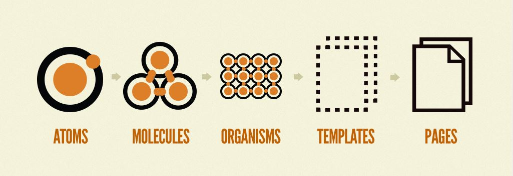
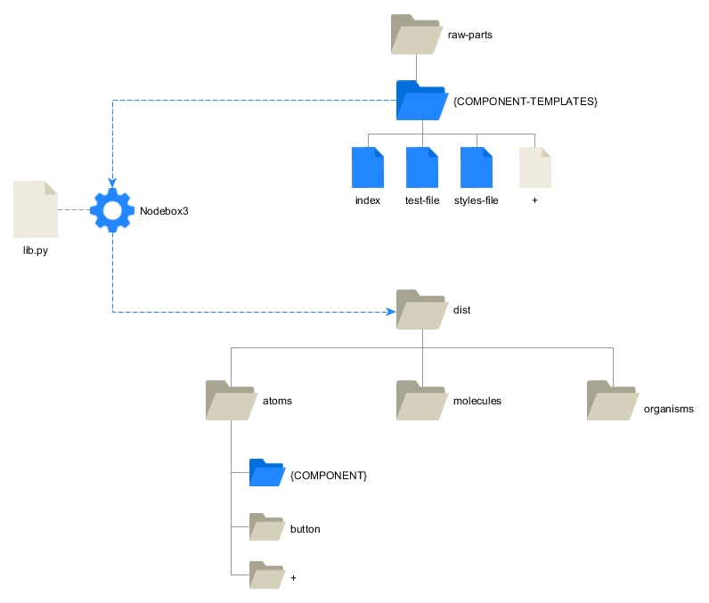
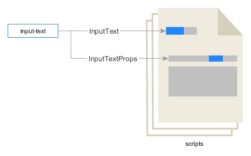
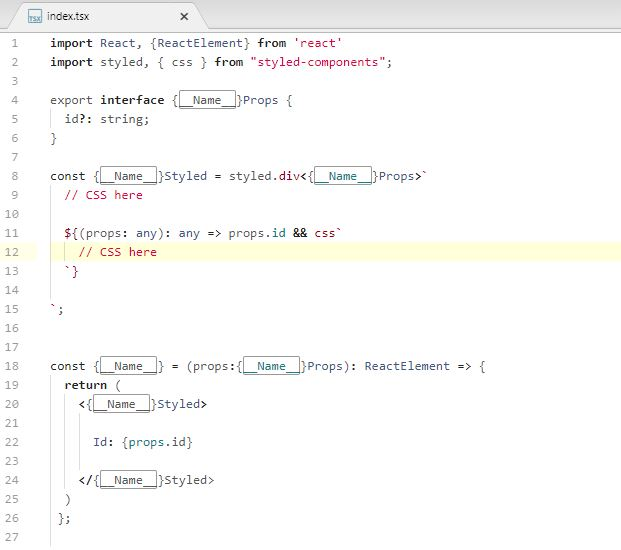
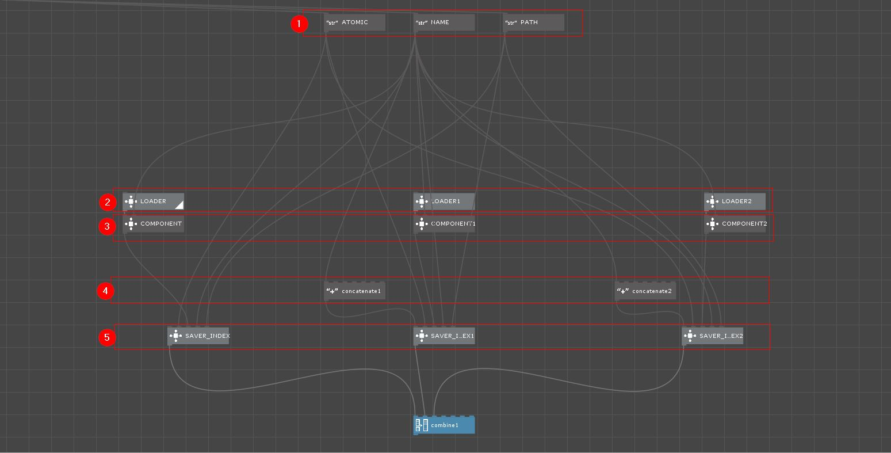
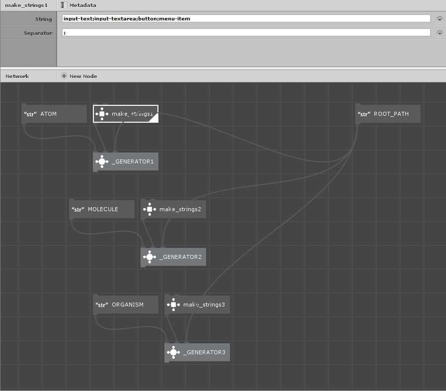

# Atomic Generator Tool

## Description

The following tool allows you to create a structure of directories and components automatically.
The methodology followed is based on the atomic design of components.

More infos: http://atomicdesign.bradfrost.com/chapter-2/

## How it works

La herramienta se compone de 3 partes:
- Directory with the templates of the different types of scripts
- Project Nodebox3
- Python Script with the functions executed by Nodebox3

Scripts templates contain placeholders in their content.
Nodebox is in charge of creating a copy of the files in the destination directory, replacing the placeholders with the defined values.

##### Parts

##### Example of the placeholders

  

##### Nodebox custom Node for the tasks

## Installation

1. Download and install Nodebox3  
https://www.nodebox.net/node/

## Usage

1. Open the file `assembler.ndbx`

2. Modify the list of components in each block: atoms, molecules, organism
  

3. Modify the `ROOT_PATH` Box of the project

4. Click on the `_GENERATOR` boxes to run the task
